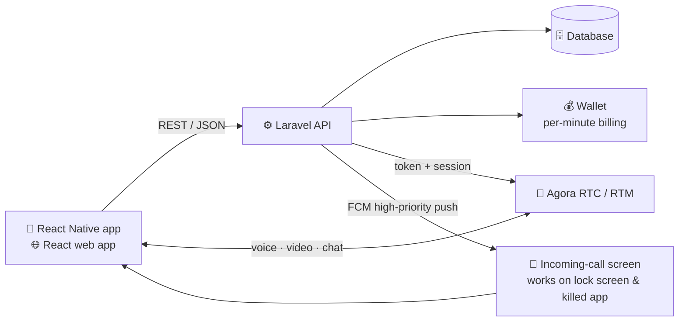

<div align="center">



<br/>

<a href="https://digitaldheerendra.in/"></a>
<a href="https://www.linkedin.com/in/digtaldheerendra"></a>
<a href="https://www.instagram.com/dheerendradigital"></a>


</div>

---

### `$ cat about.md`

I build products that have to work **while people are using them**: live chat, audio and video calls, per-minute wallet billing, and push notifications that ring a phone even when the app is killed. I also build web frontends that load fast.

For **9+ years** I've taken products from a blank repo to production and kept them running. I work across the whole system: database schema, API, web app, mobile app and deployment.

```yaml
engineer:
  name: Dheerendra Kumar
  role: Full-Stack Engineer (web + mobile)
  experience: 9+ years
  core: [Laravel, PHP, React, React Native, TypeScript, Node.js]
  strengths:
    - real-time systems (chat, voice/video calls, presence)
    - payment & wallet flows built to be safe against double-charging
    - performance-first websites (SSR, prerendering, Core Web Vitals)
    - debugging production issues nobody else could reproduce
  currently: building real-time consultation apps on web + Android + iOS
  open_to: freelance, contract & long-term product work
```

---

### `$ tree ~/architecture` — how I ship a real-time app



Most of the hard work is in the edge cases: dropped networks mid-call, wallet balance running out during a session, duplicate webhooks, Android background limits, and notifications that must ring even when the app is closed.

---

### `$ ls ~/shipped`

| Project | What it is | Stack |
|---|---|---|
| **Astrology consultation platform** | Paid chat, audio & video consultations with live wallet deduction, incoming-call UI and admin panel | Laravel · React · React Native · Agora · FCM |
| **Exam portal** | Online exams, question banks, results and admin management | PHP |
| **LPG agency system** | Management software for an LPG distribution agency | TypeScript |
| **Service-business websites** | SEO-first, prerendered React sites that score high on Core Web Vitals | React · Vite · SSR |
| **Portfolio & theme builds** | Custom portfolio and theme websites for clients | TypeScript · JavaScript |

<sub>Most client work lives in private repositories. Happy to walk through the code and architecture on a call.</sub>

---

### `$ which tools`

<p align="left">
  
</p>

**Mobile:** React Native (Android & iOS) · **Real-time:** Agora RTC/RTM, Firebase Cloud Messaging · **Web perf:** SSR, static prerendering, image & font optimisation

---

### `$ cat principles.txt`

```text
1. Production is sacred    →  every change is reversible and nothing ships untested
2. Find the root cause     →  reproduce first, then fix the cause instead of the symptom
3. Measure, don't guess    →  Lighthouse, logs and profiler before any "optimisation"
4. Boring tech, sharp code →  proven tools, clean boundaries, readable diffs
5. Own the outcome         →  I stay on it until it works on the user's phone, not just on my machine
```

---

### `$ git log --graph --all`

<div align="center">


<picture>
  <source media="(prefers-color-scheme: dark)" srcset="https://raw.githubusercontent.com/digitaldheerendra/digitaldheerendra/output/snake-dark.svg"/>
  
</picture>

</div>

---

<div align="center">

### `$ ./hire --dheerendra`

**Have a product that has to be fast, real-time and reliable?** Let's talk.

<a href="https://digitaldheerendra.in/"></a>

</div>
