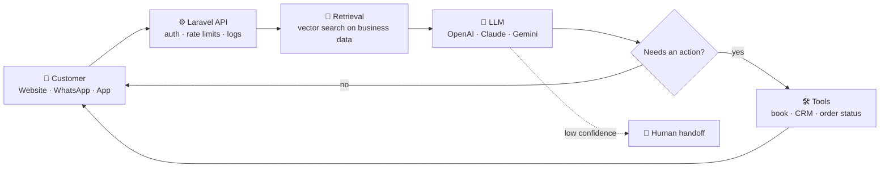
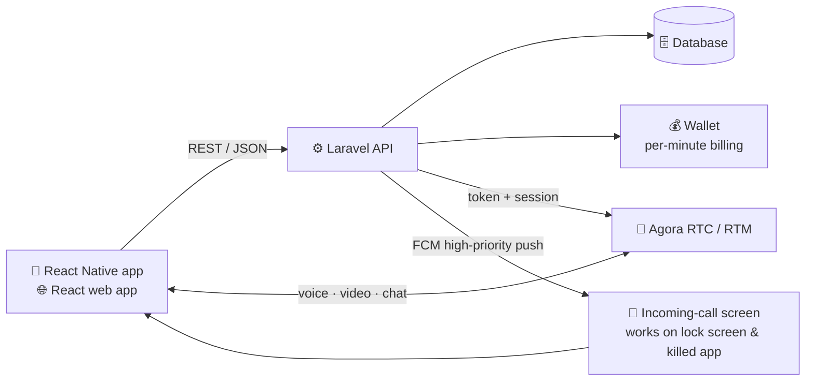

<div align="center">


<br/>

<a href="https://digitaldheerendra.in/"></a>
<a href="https://www.linkedin.com/in/digtaldheerendra"></a>
<a href="https://www.instagram.com/dheerendradigital"></a>


</div>

---

### `$ cat about.md`

I'm a **Full-Stack & AI Engineer** with **9+ years** of shipping production software in **Laravel, React, React Native and WordPress**. I now add AI to those products: chatbots that answer from a business's own data, automations that take repetitive work off a team, and LLM features inside apps people already use.

I also build the difficult real-time parts: live chat, voice and video calls, per-minute wallet billing, and push notifications that still ring when the app is killed. I usually own the whole system, from database schema and API to web app, mobile app and deployment.

```yaml
engineer:
  name: Dheerendra Kumar
  role: Full-Stack & AI Engineer (web · mobile · AI)
  experience: 9+ years
  core_stack: [Laravel, React, React Native, WordPress]
  ai:
    chatbots: website, WhatsApp & in-app assistants trained on your own data
    automation: lead handling, support triage, document & data extraction, reporting
    integration: OpenAI, Claude & Gemini APIs inside Laravel, React, mobile & WordPress
  also_strong_in:
    - real-time systems (chat, voice/video calls, presence)
    - payment & wallet flows built to be safe against double-charging
    - performance-first websites (SSR, prerendering, Core Web Vitals)
  open_to: freelance, contract & long-term product work
```

---

### `$ ls ~/stack`


---

### `$ ./ai --explain` — what I build with AI

<table>
<tr>
<td width="33%" valign="top">

#### 🤖 AI Chatbots
Website, **WhatsApp** and in-app bots that answer from **your own content**: docs, products, FAQs, policies. They capture leads, book appointments and hand the conversation to a human when needed.

</td>
<td width="33%" valign="top">

#### ⚡ AI Automation
Workflows that remove repetitive work. For example: classify and route incoming leads and emails, extract data from PDFs and forms, draft replies, sync CRMs and sheets, and send daily reports.

</td>
<td width="33%" valign="top">

#### 🧩 AI Integration
LLM features inside **existing** products: smart search, summaries, content generation, recommendations and assistants in Laravel, React, React Native and WordPress apps.

</td>
</tr>
</table>

**How a production AI chatbot is wired:**



What separates a demo from a real product: grounding answers in real data so the bot doesn't make things up, guardrails, cost and token limits, conversation logs, and a clean handoff to a human.

---

### `$ tree ~/architecture` — how I ship a real-time app



Most of the hard work is in the edge cases: dropped networks mid-call, wallet balance running out during a session, duplicate webhooks, Android background limits, and notifications that must ring even when the app is closed.

---

### `$ ls ~/shipped`

| Project | What it is | Stack |
|---|---|---|
| **Astrology consultation platform** | Paid chat, audio & video consultations with live wallet deduction, incoming-call UI and admin panel | Laravel · React · React Native · Agora · FCM |
| **Exam portal** | Online exams, question banks, results and admin management | PHP |
| **LPG agency system** | Management software for an LPG distribution agency | TypeScript |
| **Service-business websites** | SEO-first, prerendered React sites that score high on Core Web Vitals | React · Vite · SSR |
| **WordPress builds** | Custom themes, plugins and business websites for clients | WordPress · PHP |

<sub>Most client work lives in private repositories. Happy to walk through the code and architecture on a call.</sub>

---

### `$ which tools`

<p align="left">
  
</p>

**AI & automation**


**Mobile:** React Native (Android & iOS) · **Real-time:** Agora RTC/RTM, Firebase Cloud Messaging · **Web perf:** SSR, static prerendering, image & font optimisation

---

### `$ cat principles.txt`

```text
1. Production is sacred    →  every change is reversible and nothing ships untested
2. Find the root cause     →  reproduce first, then fix the cause instead of the symptom
3. Measure, don't guess    →  Lighthouse, logs and profiler before any "optimisation"
4. AI with guardrails      →  grounded in real data, logged, cost-capped, with a human fallback
5. Own the outcome         →  I stay on it until it works on the user's phone, not just on my machine
```

---

### `$ git log --graph --all`

<div align="center">


<picture>
  <source media="(prefers-color-scheme: dark)" srcset="https://raw.githubusercontent.com/digitaldheerendra/digitaldheerendra/output/snake-dark.svg"/>
  
</picture>

</div>

---

<div align="center">

### `$ ./hire --dheerendra`

**Need an AI chatbot, an automation, or a product that has to be fast and reliable?** Let's talk.

<a href="https://digitaldheerendra.in/"></a>

</div>
